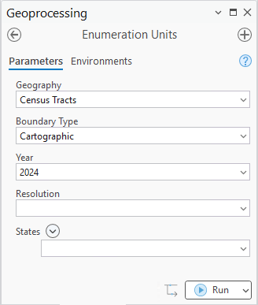
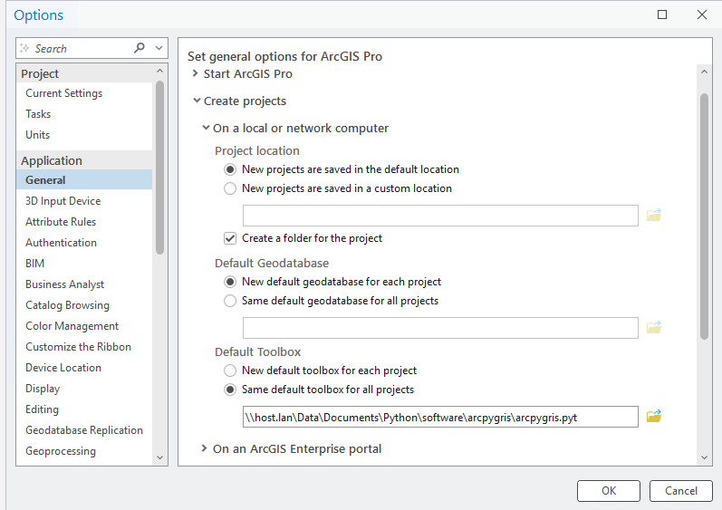

# arcpygris

`arcpygris` is an ArcGIS Pro python toolbox, inspired by the `tigris` R
package, that facilites the seamless loading of US Census TIGER/Line or
cartographic boundaries into an ArcGIS Pro project.

## Adding as a default toolbox

To make arcpygris accessible at all times, make it your default toolbox
for new projects.

To do so,

1.  Open up ArcGIS Pro
2.  Click on **Settings** -\> **Options** -\> **General**
3.  Expand the **Create Projects** dropdown and expand **On local or
    network computer**
4.  Under **Default Toolbox**, choose **Same default toolbox for all
    projects** and set the path to `arcpygris`.
5.  Press **OK** and you’re all set!

## Currently Supported Geographies

Since `arcpygris` relies on the Census TIGERweb servers, new years of
Census geographies will be added as soon as they uploaded to TIGERweb.
These are the current available years as of February 18, 2026.

| Geography | Group | TIGER/Line Years | Cartographic Years |
|:---|:---|:---|:---|
| Census Divisions | Primary Nested Geographies | 2000, 2010, 2012-2025 | 2015-2024 |
| Census Regions | Primary Nested Geographies | 2000, 2010, 2012-2025 | 2015-2024 |
| States | Primary Nested Geographies | 2000, 2010, 2012-2025 | 2015-2024 |
| Counties | Primary Nested Geographies | 2000, 2010, 2012-2025 | 2015-2024 |
| County Subdivisions | Primary Nested Geographies | 2000, 2010, 2012-2025 | 2015-2024 |
| Census Tracts | Primary Nested Geographies | 2000, 2010, 2012-2025 | 2015-2024 |
| Census Block Groups | Primary Nested Geographies | 2000, 2010, 2012-2025 | 2015-2024 |
| Census Blocks | Primary Nested Geographies | 2000, 2010, 2020 | N/A |
| Zip Code Tabulation Areas | Primary Nested Geographies | 2000, 2010, 2020 | N/A |
| Subbarrios | Places | 2000, 2010, 2012-2025 | 2015-2024 |
| Consolidated Cities | Places | 2000, 2010, 2012-2025 | 2015-2024 |
| Incorporated Places | Places | 2000, 2010, 2012-2025 | 2015-2024 |
| Census Designated Places | Places | 2000, 2010, 2012-2025 | 2015-2024 |
| Congressional Districts | Legislative | 2000, 2010, 2012-2025 | 2015-2024 |
| State Legislative Districts - Upper | Legislative | 2000, 2010, 2012-2025 | 2015-2024 |
| State Legislative Districts - Lower | Legislative | 2000, 2010, 2012-2025 | 2015-2024 |
| Voting Districts | Legislative | 2000, 2010, 2020 | 2020 |
| Unified School Districts | Schools | 2000, 2010, 2012-2025 | 2015-2024 |
| Secondary School Districts | Schools | 2000, 2010, 2012-2025 | 2015-2024 |
| Elementary School Districts | Schools | 2000, 2010, 2012-2025 | 2015-2024 |
| Combined Statistical Areas | Core-Based Statistical Areas | 2010, 2012-2021, 2023-2025 | 2015-2021, 2023-2024 |
| Metropolitan Statistical Areas | Core-Based Statistical Areas | 2010, 2012-2021, 2023-2025 | 2015-2021, 2023-2024 |
| Micropolitan Statistical Areas | Core-Based Statistical Areas | 2010, 2012-2021, 2023-2025 | 2015-2021, 2023-2024 |
| Metropolitan New England City and Town Areas | Core-Based Statistical Areas | 2010, 2012-2021 | 2015-2021 |
| Micropolitan New England City and Town Areas | Core-Based Statistical Areas | 2010, 2012-2021 | 2015-2021 |
| Combined New England City and Town Areas | Core-Based Statistical Areas | 2010, 2012-2021 | 2019-2021 |
| New England City and Town Area Divisions | Core-Based Statistical Areas | 2010, 2012-2021 | 2020-2021 |
| Tribal Census Tracts | American Indian, Alaska Native, and Native Hawaiian Areas | 2010, 2012-2025 | 2020-2024 |
| Tribal Block Groups | American Indian, Alaska Native, and Native Hawaiian Areas | 2010, 2012-2025 | 2020-2024 |
| Tribal Subdivisions | American Indian, Alaska Native, and Native Hawaiian Areas | 2000, 2010, 2012-2025 | 2020, 2022-2024 |
| Tribal Designated Statistical Areas | American Indian, Alaska Native, and Native Hawaiian Areas | 2000, 2010, 2012-2025 | 2015-2024 |
| State Designated Tribal Statistical Areas | American Indian, Alaska Native, and Native Hawaiian Areas | 2000, 2010, 2012-2025 | 2015-2024 |
| Oklahoma Tribal Statistical Areas | American Indian, Alaska Native, and Native Hawaiian Areas | 2000, 2010, 2012-2025 | 2015-2024 |
| Federal American Indian Reservations | American Indian, Alaska Native, and Native Hawaiian Areas | 2000, 2010, 2012-2025 | 2015-2024 |
| State American Indian Reservations | American Indian, Alaska Native, and Native Hawaiian Areas | 2000, 2010, 2012-2025 | 2015-2024 |
| American Indian Joint-Use Areas | American Indian, Alaska Native, and Native Hawaiian Areas | 2000, 2010, 2012-2025 | 2015-2024 |
| Off-Reservation Trust Lands | American Indian, Alaska Native, and Native Hawaiian Areas | 2000, 2010, 2012-2025 | 2015-2024 |
| Alaska Native Regional Corporations | American Indian, Alaska Native, and Native Hawaiian Areas | 2000, 2010, 2012-2025 | 2015-2024 |
| Alaska Native Village Statistical Areas | American Indian, Alaska Native, and Native Hawaiian Areas | 2000, 2010, 2012-2025 | 2015-2024 |
| Hawaiian Home Lands | American Indian, Alaska Native, and Native Hawaiian Areas | 2000, 2010, 2012-2025 | 2015-2024 |
